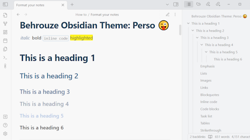
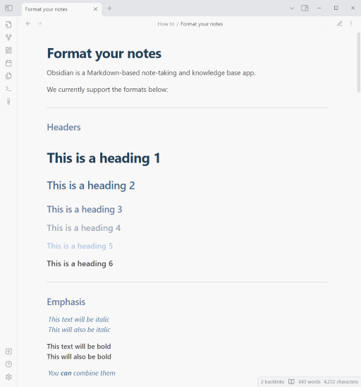
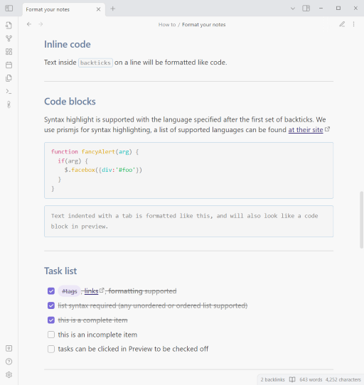

# Theme Perso
## Official repo
https://github.com/behrouze/obsidian-theme

## Motivations
Ce thème a été créé pour mon usage perso, ie :
- un thème light
- une nette séparation des headings: taille, espacement et couleurs distincts
- des extraits de code qui se détachent bien du texte autour

## Screenshots

## Contributions
Si vous constatez des problèmes ou si vous souhaitez contribuer à ce thème, veuillez soumettre une PR.